# ChainsGuard Wallet
Welcome to ChainsGuard wallet, This is a decentralized wallet app.

**Note: This wallet uses HTTP plaintext RPC communication and is not recommended for use in the mainnet environment.**

## Preview

| 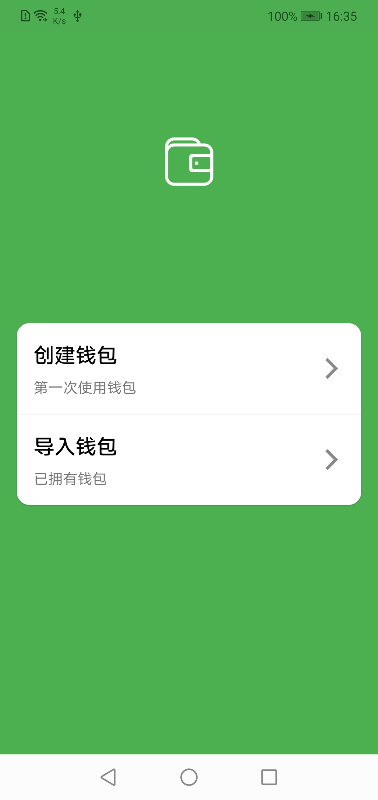 | 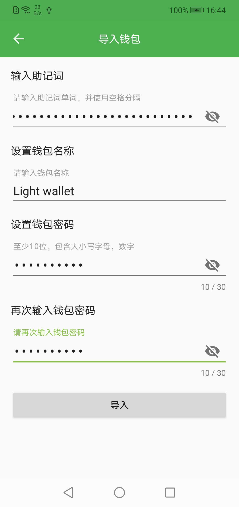  | 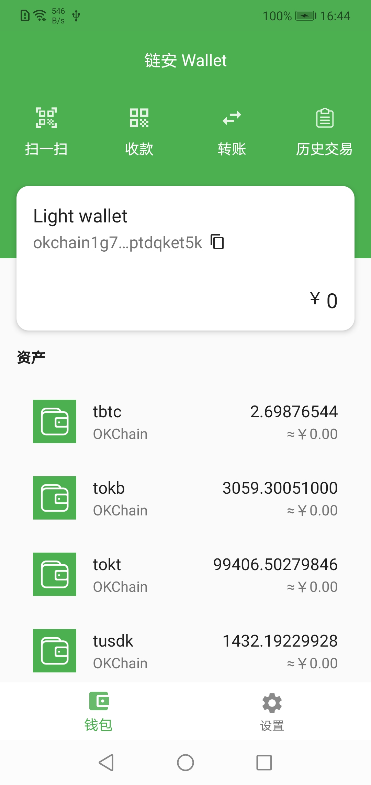  | 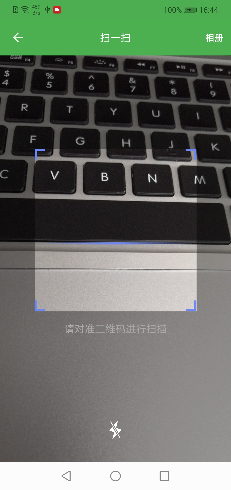 |
| :--------------------: | :---------------------: | :---------------------: | :--------------------: |
| 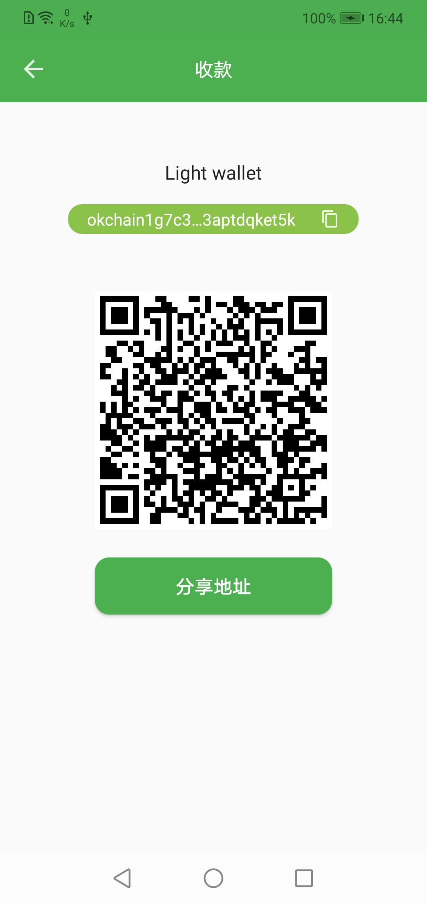 | 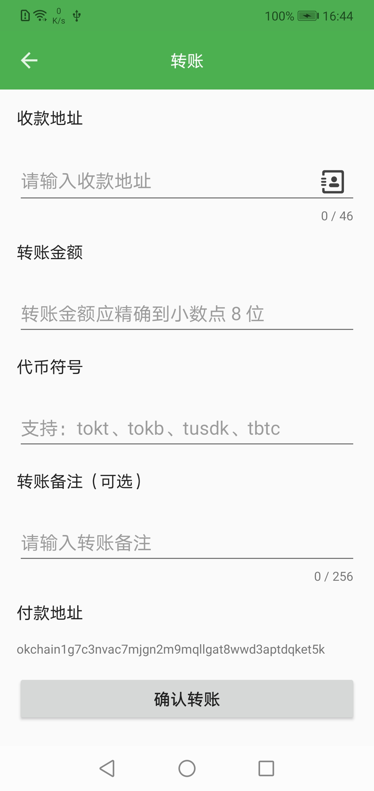  | 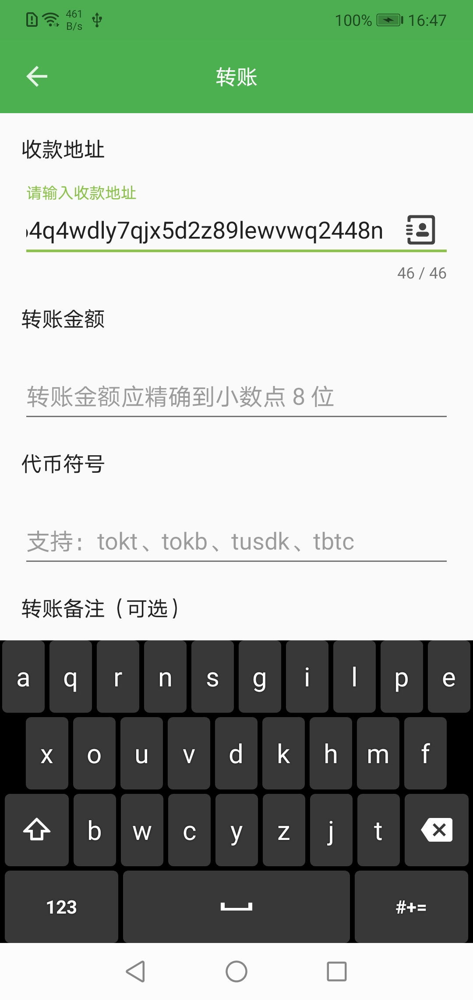  | 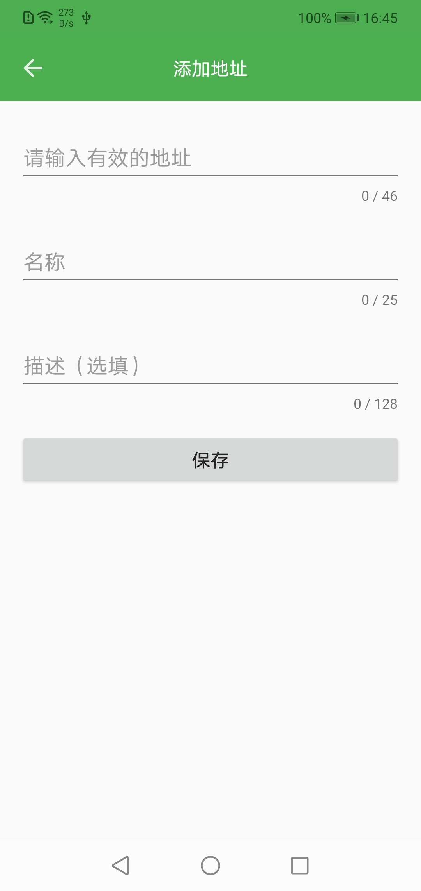 |
| 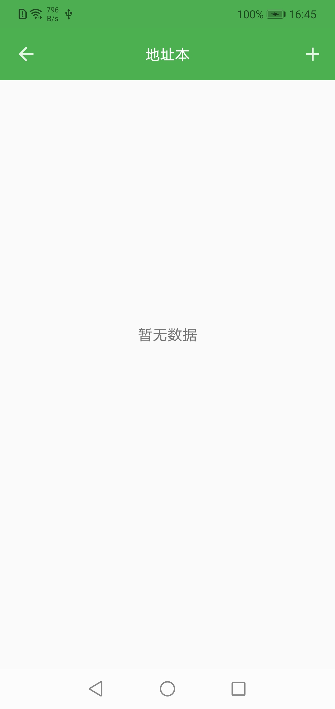 | 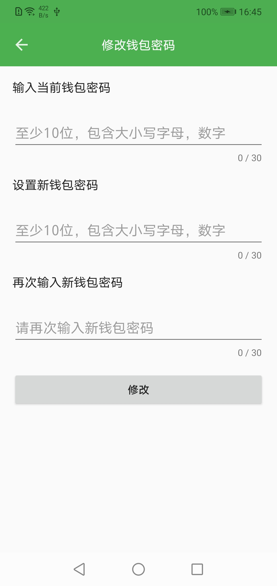 | 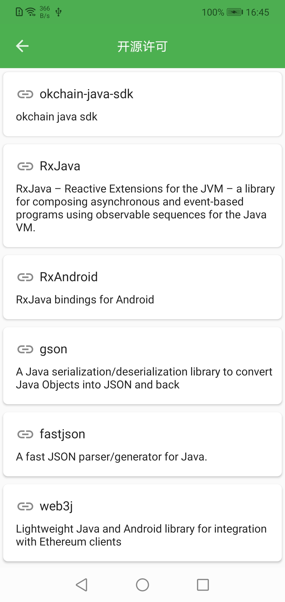 | 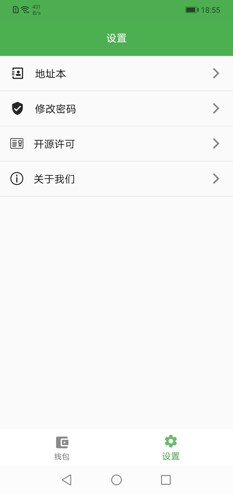|

## Features

- [x] Create & Import Wallet
- [x] Token Transfer (Support: tokt、tokb、tusdk、tbtc)
- [x] QRCode Scan Transfer
- [x] Address Book
- [x] Reset Wallet Password
- [x] Secure Soft Keyboard

## TODO

- [ ] Remove HTTP RPC
- [ ] History Transactions
- [ ] Issue token
- [ ] Staking
- [ ] ......